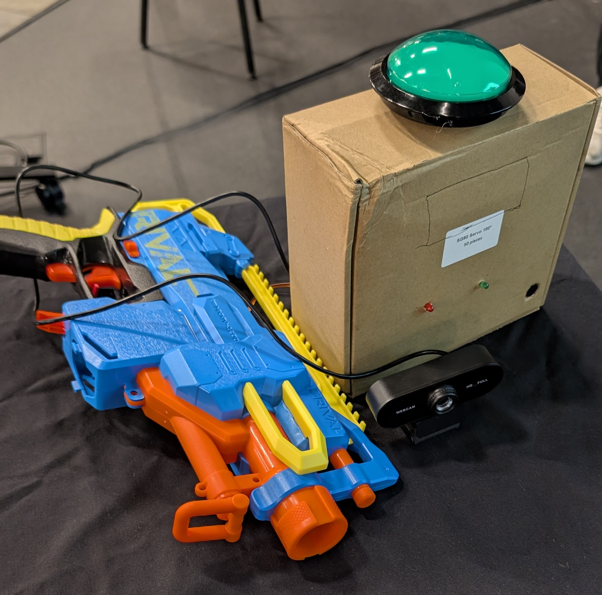
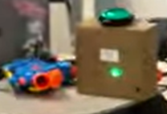
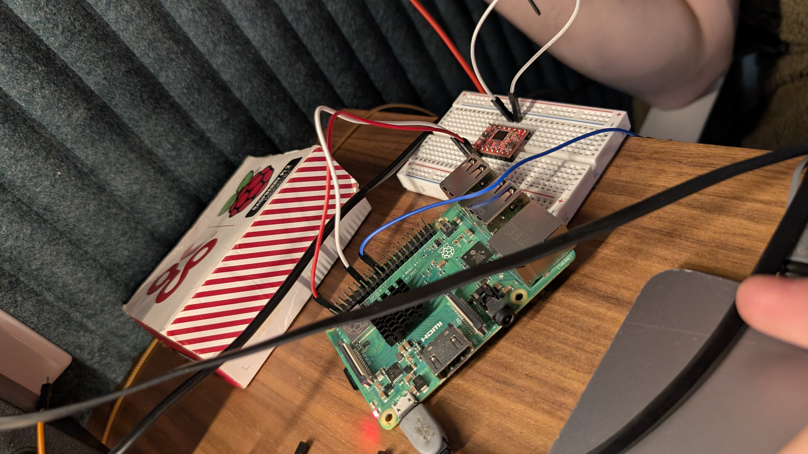
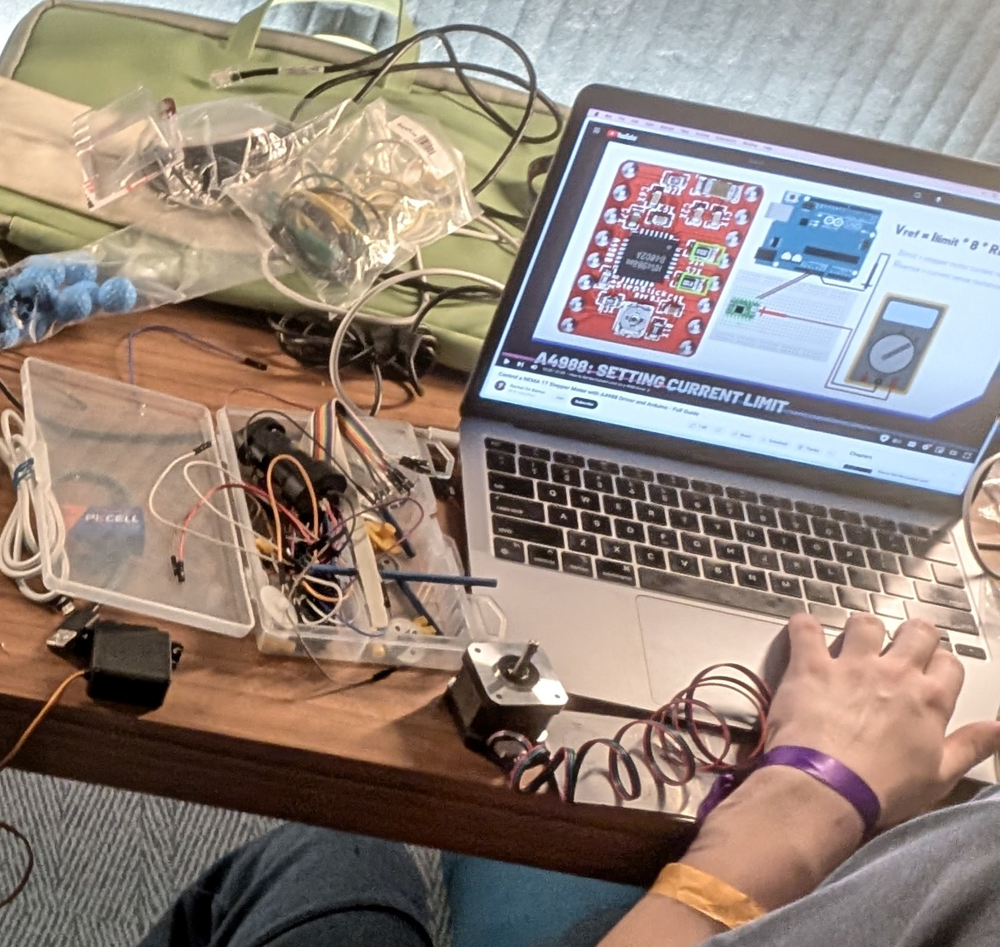
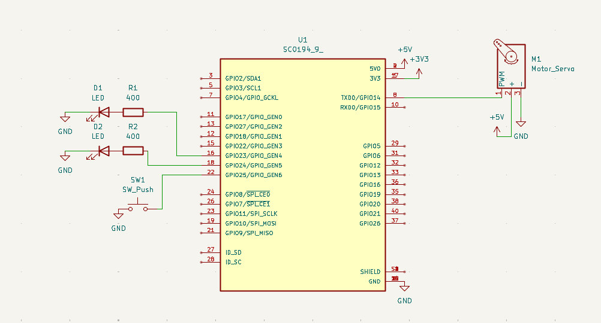

# Nerf Light

Linear Red light green light game with CV Nerf turret.

## Demo videos (Click to open video on youtube.com)

## What this is

So you've watched Squid Game before, right?....

If not, that's okay. "Red light green light" is a game where one person decides whether it's "green light" or "red light". When it's green light, the deciding person must not look at the players, while the players travel towards the deciding person. When the deciding person announces "red light", all players must halt any movement immediately. The deciding person must turn around quickly, seeing if anyone moved. Should someone move during this phase, they will be eliminated.

The TV show "Squid Game" introduces a verry deadly twist to this game: people now get shot to death if they fail in the game. This is exactly what we're trying to create.

The camera tracks people and detects movements. If a person is detected moving during red light, a beefy servo motor attached to the trigger will turn fire the (Nerf) gun (and kill the person :-[)

We encountered a technical difficulty because apparently the most powerful motor is not powerful enough to move the gun... we pivoted from the original idea to make a linear red light green light. So how is it different from the original red light green light?

1. No to (disgusting) friends
   It cannot work with your friends. Why do you have friends anyway? What are you doing? Socialising?! Impossible!!!111!!!
2. It's in a line.
   Since the gun no longer moves, you have to move towards the gun while following a straight line. Discipline yourself!!!1111!!!!

When the players reach the gun, they can press a button to end and win the game.

## Why we built this

We built this for Undercity, so we decided to build something very cool, something that people will like. With the recent Squid Game 3 releasing, I'm certain that this little invention will become very popular...

## Photo gallery

## Wiring Diagram

Keep in mind you also need to plug a USB webcam into a USB port on the pi.

## BOM

| Part name | Quantity |
| --- | --- |
| Raspberry 3B+ (or any Pi) | 1 |
| Red LED (generic) | 1 |
| Green LED (generic) | 1 |
| 400Ω Resistor | 2 |
| Electric Nerf gun (any) | 1 |
| Beefy servo motor (MG996R) | 1 |
| Stepper motor (ended up not using) | 1 |
| Stepper driver board (ended up not using) | 1 |
| Large button | 1 |
| USB Web Camera | 1 |
